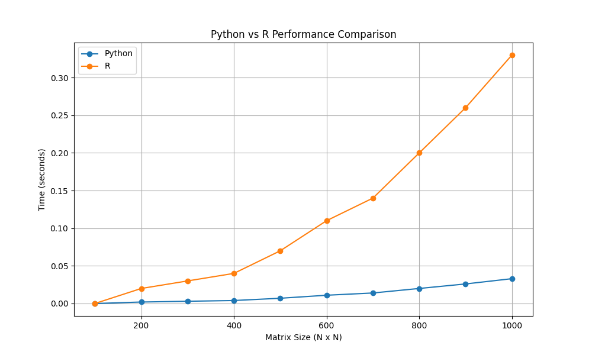

# Python vs R: Performance Comparison 🚀🐢

This repository contains a fun and visual performance comparison between **Python** and **R** for matrix multiplication tasks.  
Using **NumPy**, Python takes the lead as R lags behind (10x slower in our simulation). 📈

## 📊 Performance Results
### Python vs R Simulation

Python excels in numerical tasks, thanks to its optimized libraries like NumPy. Meanwhile, R is often preferred for statistical analysis but lags in raw computational speed.

🧰 Setup and Run
Clone this repository:
bash

🤔 Why Python?
NumPy: Highly optimized for numerical tasks.
Flexibility: A general-purpose language for data science and beyond.
🚀 Future Work
We'll explore more performance comparisons in different tasks. Stay tuned!

📧 Feedback
Have suggestions or ideas? Feel free to open an issue or reach out!

Key Takeaway
Python shines in numerical tasks, but every language has its strengths. Use the right tool for the job! 😉
